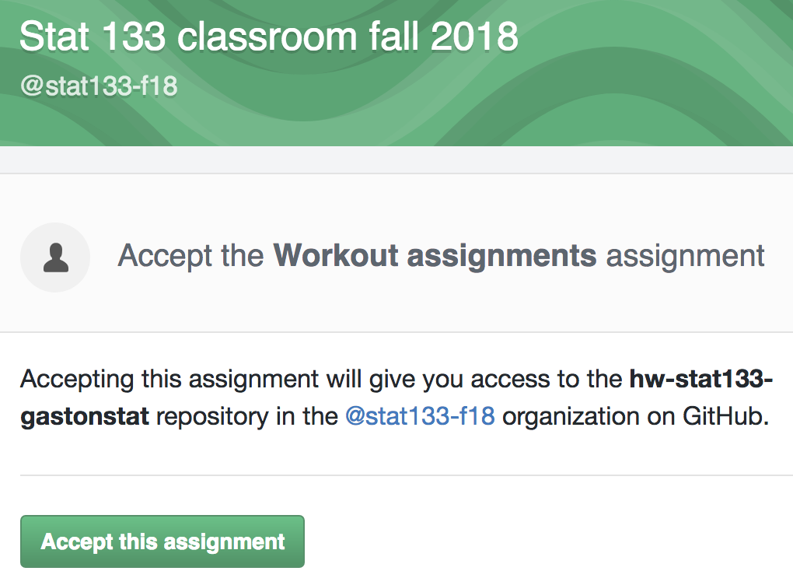
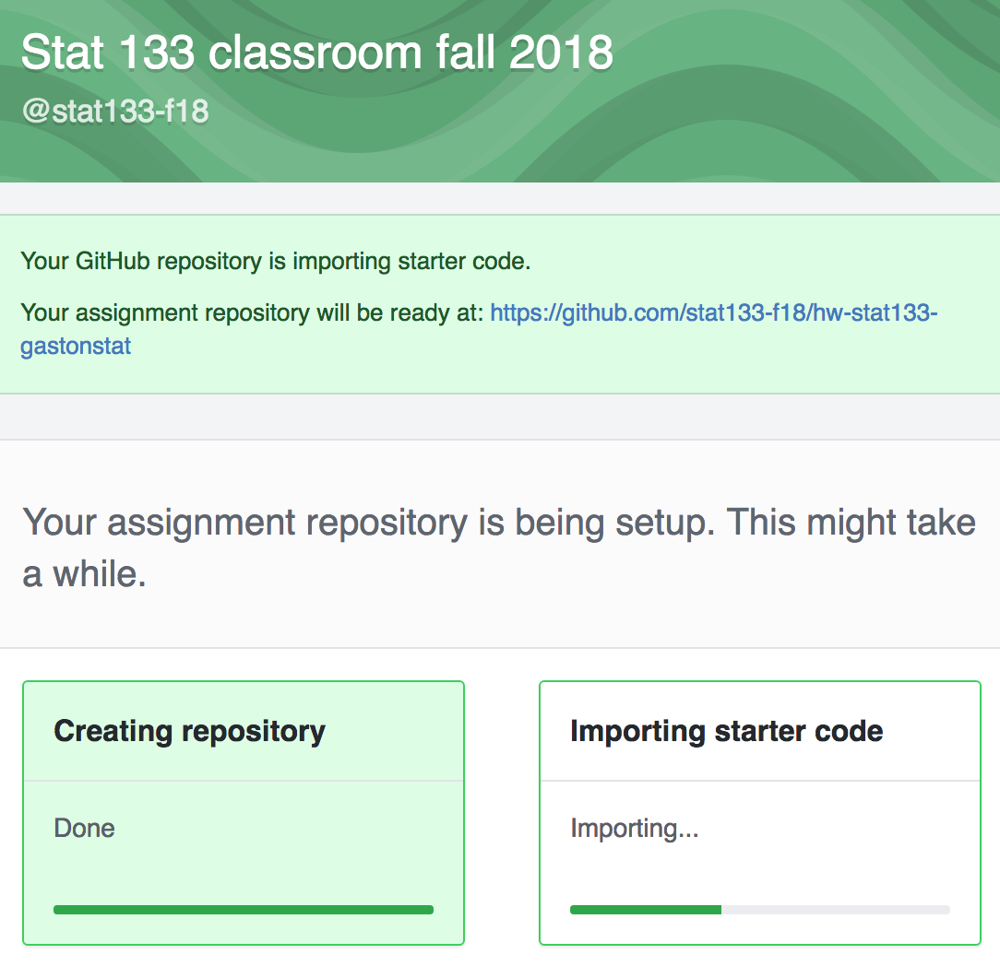
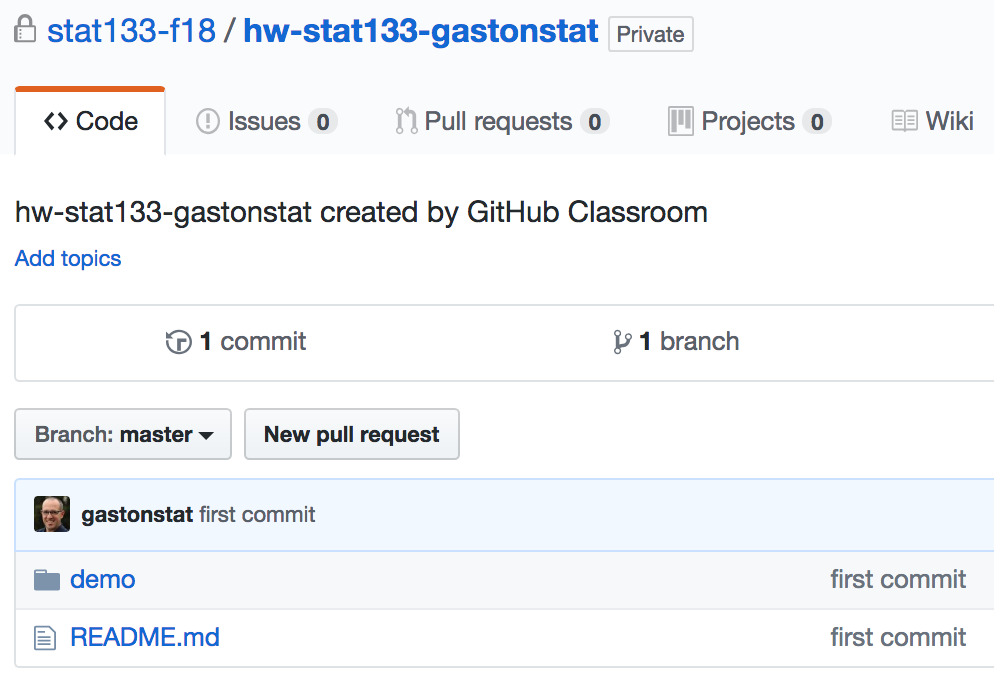
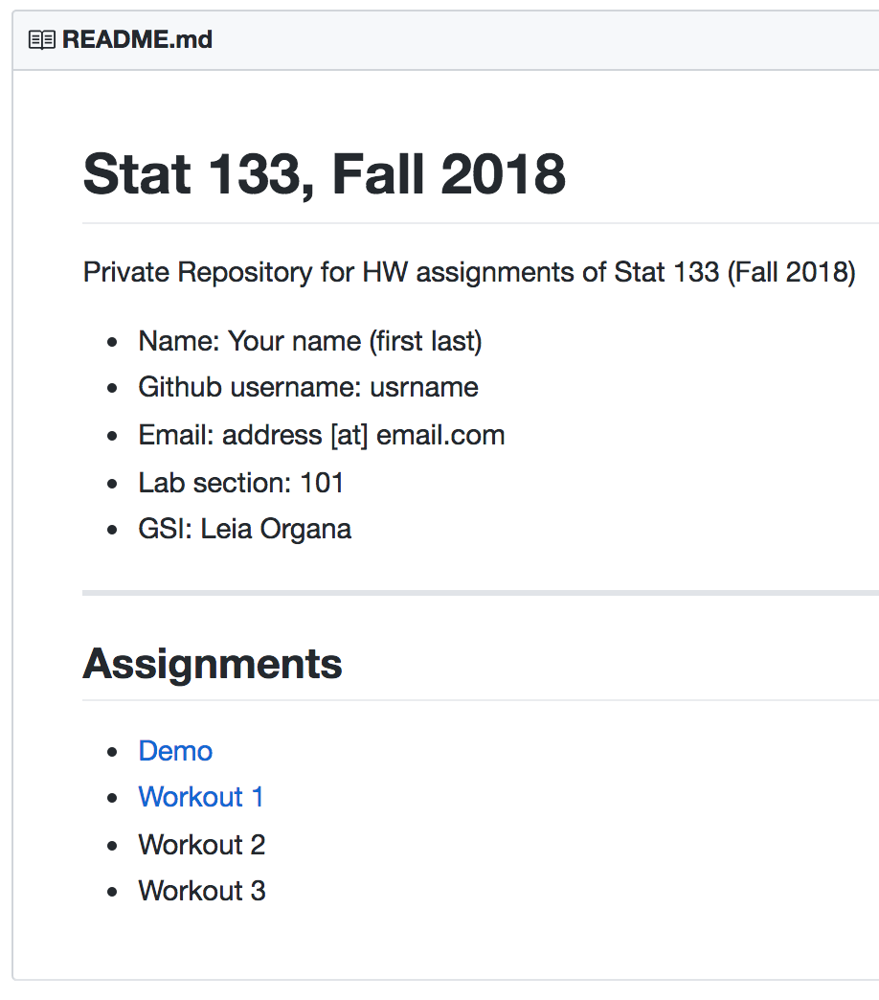

```{r setup, include=FALSE}
knitr::opts_chunk$set(echo = TRUE)
```

This document contains the instructions to get your own GitHub Classroom 
repository. This is the repo that you will use to submit your HW assignments.


## GitHub Classroom

1) Sign-in to your github account.

2) Use the following invitation link to get your __GitHub Classroom__ repository 

https://classroom.github.com/a/tcZBXBpt

3) You should get redirected to `https://classroom.github.com`, more specifically, to the "Stat 133 classroom fall 2018" organization.
Here, you will see a message _"Accept the Workout assignments"_
assignment.

```{r fig.width=2, out.width='60%', echo = FALSE, fig.align='center'}

```

4) After clicking on the __Accept this assignment__ button, you should be able to 
see a new message indicating that your assignment repository is being setup: this involves 1) creating the repository, and 2) importing starter code. 

```{r fig.width=2, out.width='60%', echo = FALSE, fig.align='center'}

```

5) When the setup is finished, you should see the message _You are ready to go!_

```{r fig.width=2, out.width='70%', echo = FALSE, fig.align='center'}
knitr::include_graphics('lab04-images/classroom3.png')
```

6) At this moment, you will receive an email with an invitation to join 
`@stat133-f18`. In theory, there is no need to accept
the invitation since your repository has already been created.


## Your Private GitHub Classroom Repository

What you need to do next is to click on the assignment link created for your 
github account. You should be able to see your new repository

```{r fig.width=2, out.width='70%', echo = FALSE, fig.align='center'}

```

As you can tell, your repo contains a `README.md` file with some default 
content:

```{r fig.width=2, out.width='70%', echo = FALSE, fig.align='center'}

```


### Edit the `README.md` file

Click on the `README.md` file, and then look for the icon of a pencil so that
you can edit the contents of the file.

Customize the information about `Name`, `Github username`, your `Email` address
(the one linked to your github account), the `Lab section` you are registered in,
and the name of your `GSI`

Look for the button __Commit changes__ so you can "save" the modifications 
done to the `README.md` file.


# Your Local Repo and the Remote Repo

So far you have your GitHub Classroom repository. This repository will be
your _remote_ repository. However, you also need to to create a _local_
repository in your computer.

- Open a bash terminal
- Optional: change directory to your preferred location e.g. your Desktop
- Create a directory, and `cd` to it:

```bash
mkdir hw-stat133
cd hw-stat133
```

- Initialize the directory as a Git repository

```bash
git init
```

- Locate the name of your github repo (with __your own username!!__)

`https://github.com/stat133-f18/hw-stat133-gastonstat`

- To add a remote repository use the command below with __your own username__:

```bash
git remote add origin https://github.com/stat133-f18/hw-stat133-gastonstat
```

- Pull down the content in the remote repo (`origin`) to your local repo (`master`)

```bash
git pull origin master
```


## Pushing changes to the remote repo

Now that you have linked your local repo with your remote repo, you can start 
pushing (i.e. uploading) commits to GitHub. Try the following modifications.

In your computer (your local repo), use a text editor (e.g. the editor in RStudio) 
to open the `README.md` file that is inside the `demo/` folder. Under the 
title __Demo__, you should be able to see a first line of text:

```
This is just a demo folder with some dummy content.
```

Delete the starting paragraph and replace it with the text below 
(or any other text that you want to add):

```
This is just a demo folder for testing purposes.
```

Now follow these steps:

- Save the changes made in `README.md`.
- Go to the your bash terminal.
- Change directory to the `demo/` folder:

```bash
cd demo
```

- Check the status

```bash
git status
```

- Add the changes to git:

```bash
git add README.md
```

- Commit the changes with a descriptive message:

```bash
git commit -m "demo: update readme file"
cd ..
```

- Push the changes to the remote repo (`origin`) from your local repo (`master`)

```bash
git push origin master
```

Go to your Github repository and refresh the browser. If everything went fine, 
you should be able to see the contents of the `README.md` file inside `demo/`.


## Push your Warm-up 1 assignment

Let's add your warmup1 `.Rmd` file, and its knitted file, to your local 
repo, and then push the modifications to your remote repo.

- Copy the `.Rmd` file of the first warm-up assignment and save it inside the 
folder `warmup1/` (of your local repo).

- Open the `.Rmd` file and modify the `output` field of the yaml header: instead
of using `output: html_document`, change it to: `output: github_document`.

- Knit the `.Rmd` file. This should generate an `.md` file.

- Go to the bash terminal and check the status

```bash
git status
```

- Add the changes:

```bash
git add warmup1/.
```

- Check the status again:

```bash
git status
```

- Commit and push the changes:

```bash
git commit -m "warmup1: add Rmd and md files"

git push origin master
```

- Go to your Github repository and refresh the browser.
